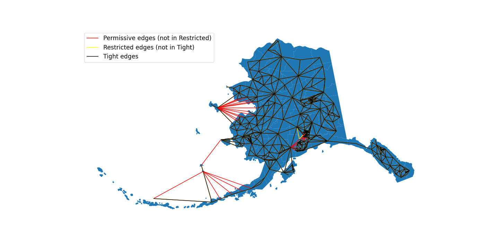

# Alaska Election Shapefile
This shapefile was obtained from the Alaska Division of Elections and processed by members of the Metric Geometry and Gerrymandering Group (MGGG). 

## Sources
The precinct shapefile and election results were downloaded from the [Alaska Division of Elections website](http://www.elections.alaska.gov/Core/electionresources.php). Demographic data was downloaded from the 2010 Decennial Census at the census block level from [IPUMS NHGIS](https://www.nhgis.org).

## Processing
Election data from the Alaska Division of Elections was cleaned and converted to a CSV by MGGG staff so it could be joined to the precinct shapefile. Demographic data was aggregated from the block level to the precinct level using [MGGG’s proration and roundoff tools](https://github.com/gerrymandr/Preprocessing). Roundoff was used to assign Alaska house districts to precincts.

## Metadata
* `ID`: Unique identifier
* `AREA`: Area of precinct
* `DISTRICT`: Precinct code
* `NAME`: Precinct name and code
* `POPULATION`: Total population in precinct
* `USH14D`: Number of votes for 2014 Democratic house candidate
* `USH14R`: Number of votes for 2014 Republican house candidate
* `USH14L`: Number of votes for 2014 Libertarian house candidate
* `PRES16D`: Number of votes for 2016 Democratic presidential candidate
* `PRES16R`: Number of votes for 2016 Republican presidential candidate
* `PRES16L`: Number of votes for 2016 Libertarian presidential candidate
* `PRES16G`: Number of votes for 2016 Green Party presidential candidate
* `PRES16C`: Number of votes for 2016 Constitution Party presidential candidate
* `SEN16D`: Number of votes for 2016 Democratic senate candidate
* `SEN16R`: Number of votes for 2016 Republican senate candidate
* `SEN16L`: Number of votes for 2016 Libertarian senate candidate
* `USH16D`: Number of votes for 2016 Democratic house candidate
* `USH16R`: Number of votes for 2016 Republican house candidate
* `USH16L`: Number of votes for 2016 Libertarian house candidate
* `GOV18D`: Number of votes for 2018 Democratic gubernatorial candidate
* `GOV18R`: Number of votes for 2018 Republican gubernatorial candidate
* `GOV18L`: Number of votes for 2018 Libertarian gubernatorial candidate
* `USH18D`: Number of votes for 2018 Democratic house candidate
* `USH18R`: Number of votes for 2018 Republican house candidate
* `TOTPOP`: Total population
* `WHITE`: White population
* `BLACK`: Black population
* `AMIN`: American Indian and Alaska Native population
* `ASIAN`: Asian population
* `NHPI`: Native Hawaiian and Pacific Islander population
* `2MORE`: Two or more races population
* `VAP`: Total voting age population
* `WVAP`: White voting age population
* `BVAP`: Black voting age population
* `AMINVAP`: American Indian and Alaska Native voting age population
* `ASIANVAP`: Asian voting age population
* `NHPIVAP`: Native Hawaiian and Pacific Islander voting age population
* `OTHVAP`: Other race voting age population
* `2MOREVAP`: Two or more voting age population
* `HDIST`: AK house district

## Projection
This shapefile uses a NAD83/Alaska Albers projection or EPSG: 3338.

## Rating
We give this shapefile an A rating. All data was obtained from the state government and was processed by MGGG staff.

# Dual Graphs
The three dual graphs in this repository have been created via the process outlined in an MGGG examination of Alaska's nested districts, available as a preprint [here](https://mggg.org/uploads/Alaska.pdf). Though we recommend consulting the paper for a deeper understanding of the dual graph constructions, the following principles were used :
- `ak_permissive.json`: this graph represents the _permissive_ graph from the paper, in which precincts are considered connected even if they only touch via a water border. The only manually fixed discontinuity were in the Kodiak Islands and in island precincts along the coast of western Alaska.
- `ak_restricted.json`: this graph represents the _restricted_ graph from the paper, in which precincts were first clipped to land using the Census Bureau Cartographic Boundary file, which removes some edges that cross water
- `ak_tight.json`: this graph represents the _tight_ graph from the paper, and keeps the fewest number of water adjacencies in place possible to consider the current State House map fully connected.

All three graphs are fully connected, and the edges in `tight` are a subset of those in `restricted`, which is in turn a subset of `permissive`. A comparison of the edges can be seen in the following image:

If planning to run GerryChain on this shapefile, we suggest loading one of these graphs via `Graph.load_json()` instead of creating a graph from `Graph.from_file()` and saving that graph locally for further use.
